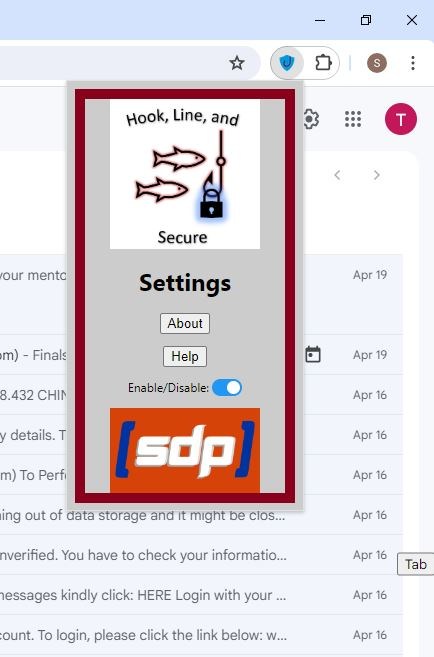
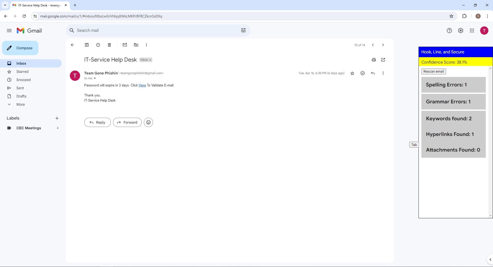
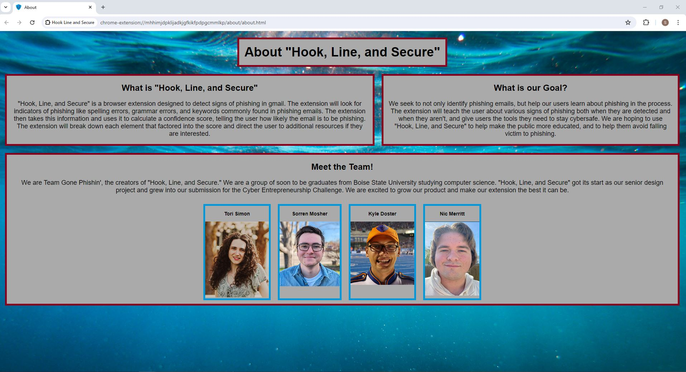
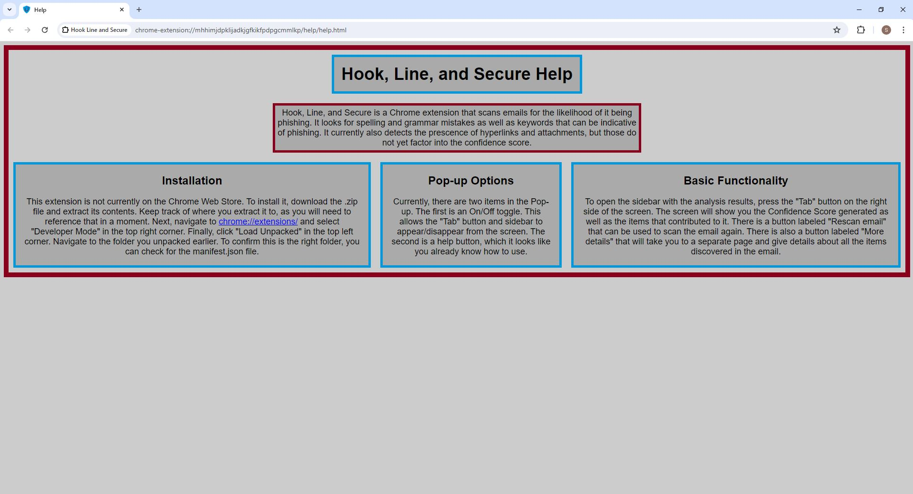
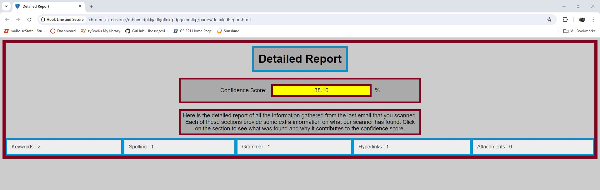

# Hook, Line, and Secure

## Abstract:
Ransomware and other malware is increasingly becoming a problem for individuals and organizations alike. This insidious malware is often distributed through convincing spear phishing emails which, with the advent of AI, have gotten increasingly sophisticated. Our small-footprint solution, “Hook, Line, and Secure”, is a browser extension which seeks to identify spear phishing and educate users through email scanning and the generation of a report. This extension aims to reduce the success of spear phishing attacks and improve user trust. Hook, Line, and Secure is our team's solution to Dr. Edward Vasko's proposed spear phishing problem statement for the 2024 Cybersecurity Entrepreneurship Challenge.

## Project Description:
Hook, Line, and Secure is a browser extension for Gmail account users on the latest version of Google Chrome. It is capable of analyzing emails for signs of phishing such as spelling and grammar errors, keywords, and the presence of hyperlinks and attachments. The email is then given a confidence score from 0-100% indicating the likelihood of phishing based on these components. The higher the percentage, the more the user is at risk. Each element is given a breakdown that further explains the exact areas of the email that are indicative of phishing. Hook, Line, and Secure also provides links to additional educational resources for our users to learn more about spear phishing and how to better avoid it.

### Settings Menu

### Extension Sidebar

### About Page

### Help Page

### Detailed Report

## Members:
 - Kyle Doster
 - Nic Merrit
 - Sorren Mosher
 - Tori Simon
